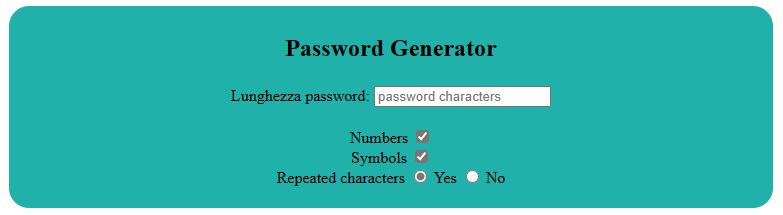
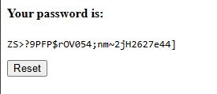

## Descrizione
Lo scopo del questo progetto è di generare una password più o meno complessa dati i seguenti input
- Lunghezza password
- Possibilità di ripetere caratteri o meno
- Possibilità di includere numeri
- Possiiblità di includere simboli.

Pagina indice

Dopo aver completato i vari campi, alla pressione del tasto 'invio', avverrà un reindirizzamento verso una nuova pagina che mostra la password generata e un button di reset per ricominciare la procedura.

